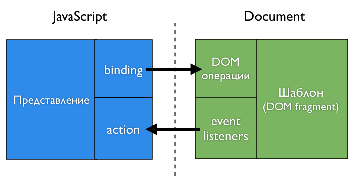
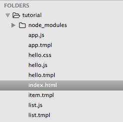
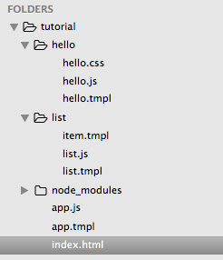
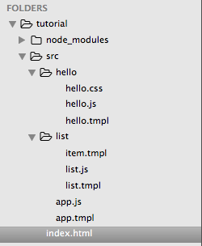
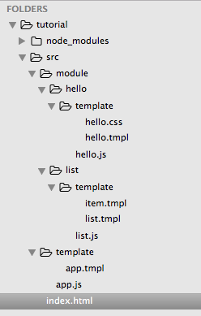
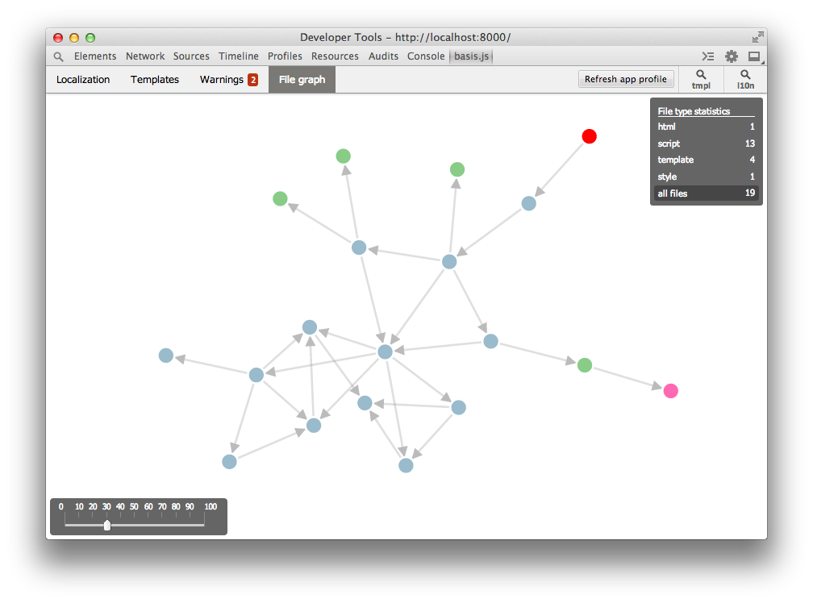

# Tutorial. Part 1. Getting Started: views, modules, tools

[Contents](../index.md)

**Sections**
<!-- MarkdownTOC -->

- [Getting started](#getting-started)
- [Preparations](#preparations)
  - [Dev-server](#dev-server)
  - [Index file and adding basis.js](#index-file-and-adding-basisjs)
- [Our first view](#our-first-view)
- [Modules](#modules)
  - [Advantages of using modules](#advantages-of-using-modules)
- [Bindings and actions](#bindings-and-actions)
- [List](#list)
- [Composition](#composition)
  - [Satellites](#satellites)
- [Tuning file structure](#tuning-file-structure)
- [Tools](#tools)
- [Build process](#build-process)
- [Outro](#outro)

<!-- /MarkdownTOC -->

## Getting started

We'll cover how to start working with `basis.js` and what tools we may use. We will create a few simple views, and will talk about modules in a project sctructure and about file structure in a project in general.

## Preparations

We will need:

- a console (command line)
- a local web-server
- a browser (preferrably `Google Chrome`)
- your favorite text editor

Let start in a project folder. Assume the folder is empty.

### Dev-server

While developing there is no need to build a `basis.js`-project. Though it needs a web-server. Any web-server may be sufficient, but it would be better to use a dev-server, which comes with `basisjs-tools`. That server gives more opportunities during a development process.

`basisjs-tools` is a set of command line tools written on `javascript` and running with `node.js`. The set includes a builder, a dev-server and a code generator. It can be installed with `npm`:

    > npm install -g basisjs-tools

When installed globally (with `-g` flag) it gives a new command `basis` in the console.

Let's run dev-server:

    > basis server

The server will start on `8000` port (it can be changed with a flag `--port` or `-p`). Now one can open this link `http://localhost:8000` in a browser and make sure that the server is working. Though it shows an error since our project folder is still empty. Let's fix it!

### Index file and adding basis.js

First of all one needs to add a folder with `basis.js` source files into the project. For this one may either clone the [repository](https://github.com/basisjs/basisjs) or use `npm`:

    > npm install basisjs

Let's create `index.html` - a main `html`-file of the app. At first it only adds `basis.js`.

```html
<!doctype html>
<html>
<head>
  <meta charset="utf-8">
  <title>My first app on basis.js</title>
</head>
<body>
  <script src="node_modules/basisjs/src/basis.js" basis-config=""></script>
</body>
</html>
```

Nothing unusual up to now. The only thing that may draw a question is a `basis-config` attribute in the `<script>` tag.

That attribute tells `basis.js` core where to find `<script>` tag, in which the framework was added. It is necessary to define a path to `basis.js` source files and to resolve paths to its modules.

## Our first view

For now our page is blank. Let's add some sense into it and output classic "Hello world".

Let's create a view with a following representaion:

```html
<!doctype html>
<html>
<head>
  <meta charset="utf-8">
  <title>My first app on basis.js</title>
</head>
<body>
  <script src="node_modules/basisjs/src/basis.js" basis-config=""></script>
  <script>
    var Node = basis.require('basis.ui').Node;

    var view = new Node({
      container: document.body,
      template: '<h1>Hello world!</h1>'
    });
  </script>
</body>
</html>
```

After the page refresh one can see "Hello world!". As it was planned. What have just happened here?

To start with we said we need `basis.ui` module, using a `basis.require` function. This function is almost the same as `require` function in `node.js`. It can include modules by its' names or by its' file names. In this case `basis.ui` is a module name. As we'll see, this function can "include" any file by its name.

We needed `basis.ui` module, because it provides all necessary things for building interfaces. However this module requires other modules, one may not think about it, because `basis.js` will do the work. One should require only those modules which are explicitly used in the code that one writes.

Secondly we created a representaion itself as a `basis.ui.Node` class instance. Let's not be confused with the name `Node` instead of classic `View`. The thing is in `basis.js` all components and views are put one into another. Thus a certain block might look like as a whole thing, but in fact may consists of a plenty of sub-representaions (nodes).

> The whole interface is organized as a big tree. View nodes of the app are the tree nodes. One can transform the tree adding, deleting and moving those nodes. The tree API has a lot in common with the browser `DOM`. We will cover it later.

In the meantime, let's see how we created the view. Firstly we passed to the constructor an object with some "settings" - a config. Setting a `container` property we pointed out where to put the view's `DOM`-fragment when it will be ready. It must be a `DOM`-element. The `template` property describes a template (who would've thought!). That description was added directly in the config. This option is handy for quick prototyping and for examples. But for real applications it is not a good practice at all. We'll change this part of the example later.

## Modules

While developing we try to isolate logical parts of our app and put those parts in separate files. Less code in a file, easier to work with it. Ideally a module's code should fit into one screen, a maximum of two. But, of course, there are always exceptions.

Let's move a view code into a separate module. To do this, create a file `hello.js` and move lines from `<script>` into it.

And that's all for now. Just include this new module in `index.html`:

```html
<!doctype html>
<html>
<head>
  <meta charset="utf-8">
  <title>My first app on basis.js</title>
</head>
<body>
  <script src="node_modules/basisjs/src/basis.js" basis-config=""></script>
  <script>
    basis.require('./hello.js');
  </script>
</body>
</html>
```

Again one can `basis.require` function, but now its argument is a path to a file. It's important to start the path with `./`, `../` or `/`. This tells to `basis.require` to treat the argument as a path to a file not as a module name. The same convention works in `node.js`.

Continue to modularity. For example why do we need `html` in a javascript file? Let's move it to a separate file, name it `hello.tmpl`. See the changes in our module:

```js
var Node = basis.require('basis.ui').Node;

var view = new Node({
  container: document.body,
  template: basis.resource('./hello.tmpl')
});
```

The difference is a stirng describing a template was replaced with a call to a `basis.resource` function. This function creates an "interface" to the file. This approach makes it possible to determine which files are really needed, and download them not earlier than there is need for them.

An interface created by `basis.resource` is a function with extra methods. A call to this function or to its method `fetch` downloads the file. The files is loaded only once, and the result is cached. More details on that can be found in an article [Resources (modularity)](../../resources.md).

And one more thing. Call to `basis.require('./file.name')` is equivalent to `basis.resource('./file.name').fetch()`.

In this case `basis.require` can be used. But more often case is when templates are described directly in classes. And there is no need to load a file before at least one instance of the class is created. We'll see it later in examples. For uniformity reasons it is better to use `basis.resource` when assigning a template to a node.

### Advantages of using modules

When the code is described in a separate file and is connected as a module, it is wrapped in a special way, and several additional variables and functions became available in the code.

For example, the file name can be obtained from a variable `__filename`, and the folder name where the module was placed can be obtained from a variable` __dirname`.

But more important is that local functions `require` and `resource` became available too. They work the same way as `basis.require` and `basis.resource`, except the way how relative file paths are resolved. If the function `basis.require` and `basis.resource` are provided with a relative path, it is resolved with respect to `html` file (in our case it is `index.html`). At the same time, `require` and` resource` resolve such a path relative to the module (ie, to the its `__dirname`).

It is more convenient to use local functions and `require`` resource` inside modules. So the code in `hello.js` is a little easier now:

```js
var Node = require('basis.ui').Node;

var view = new Node({
  container: document.body,
  template: resource('./hello.tmpl')
});
```

> Modularity provides additional capabilities not only to `javascript` modules, but also to other types of content. For example, if the description of the template lies in a separate file, it is not necessary to update the page when it changes. Once the changes have been saved, all instances of the views that use the modified template, update their own `DOM` fragments. And all this happens without reloading the page, maintaining the current state of the application.

The same applies to the `css` files, to localization files and to some other file types. The only changes that require a page reload are changing the `html` file and changing any `javascript` modules that have already been initialized.

It is the dev-server from `basisjs-tools` who provides this mechanism of updatig files. This is one of the main reasons why it is wise to use it, rather than the usual web server.

Let's try how it works. Create a file `hello.css`, like this:

```css
h1
{
  color: red;
}
```

And let's change slightly the template (`hello.tmpl`):

```html
<b:style src="./hello.css"/>
<h1>Hello world!</h1>
```

Once the template changes are saved, the text turns red. There is no need to refresh the page.

In the template we have added a special tag `<b: style>`. This tag says that when you use this template, you need to connect the specified stylesheet to the page. Relative paths are resolved with respect to the template file. Any number of stylesheet files can be connected to a template. We do not need to worry about adding and removing styles. The framework takes care of it.

So, we have just created a simple static view. But in web applications it is all about dynamics. So let's try to use ​in the template some values ​from the view and try to somehow communicate with it. For the first one can use _bindings_, and for the second - for communication - _actions_.

## Bindings and actions

Bindings allow to transfer values ​​from a view to its `DOM` fragment. Unlike most template systems, `basis.js` templates have no direct access to properties of a view. And so bindings can use only those values ​​that the view itself provides to a template.

To set ​​which values will be available in a given template, use a `binding` property in a description of an instance or of a class that inherits from `basis.ui.Node`. The values (bindings) are described in the form of the object, where keys are names that will be available in the template, and each value (of a `basis.ui.Node.binding` object) is a function that calculates a corresponding value (a binding) for the template. So the function only parameter is the owner of the template, that is the view itself. This is how you can provide a `name` value in a template:

```js
var Node = require('basis.ui').Node;

var view = new Node({
  container: document.body,
  name: 'world',
  template: resource('./hello.tmpl'),
  binding: {
    name: function(node){
      return node.name;
    }
  }
});
```

It is worth mentioning that the `binding` property is an [auto-extensible property](../../basis.Class.md#autoextending). When you set a new value for the property, or when you create an instance of the class, the new value extends the previous one, adding and overriding previous values. By default, `basis.ui.Node` already have [some useful properties](../../basis.ui_bindings.md#default-bindings), which can be used together with a certain contact `name`.

Let's change the template (`hello.tmpl`) to use the `name`.

```html
<b:style src="./hello.css"/>
<h1>Hello, {name}!</h1>
```

To place binded values (bindings) somewhere in a templates one uses markers They look like a string in the curly brackets. In this case, we have added a `{name}` marker, which inserts the value as plain text. Also, the markers are used to obtain links on certain parts of the template, but more on that later.

That template description is similar to formats used in other template systems. But unlike many of them, `basis.js` template engine works with `DOM` nodes. For the current template description there will be created an `<h1>` element, which will contain three text nodes `Hello,`, `{name}` and `!`. The first and the last node are static, and their text remain unchanged. But the middle one will get its value from the representaion (the `nodeValue` property of the corresponding `DOM` node will be changed).

But enough words, let's update the page and look at the result!

Now add an input field to enter a name. And we'll see how the title is changed. Let's start with a template:

```html
<b:style src="./hello.css"/>
<div>
  <h1>Hello, {name}!</h1>
  <input value="{name}" event-keyup="setName"/>
</div>
```

An `<input>` element was added to our template. Same binding `{name}` is used in `value` attribute of the `<input>` and in the title. Changes in the view lead to changes in `DOM` but not visa versa.

For view to react on events in its `DOM` fragment let's add to a desired element an attribute which name is the name as the event name but with the prefix` event-`. We can add any action to any element on any event. And each one event on a certain element can trigger a number of actions. To describe it just list all action using space as a separator.

In our example, we added an attribute `event-keyup`, which obliges the view to perform a `setName` action, when a `keyup` event is triggered. If there is no such action defined in the view, we will see a warning message about this in the console and nothing else will happen.

And now let's add a description of the action. To do this, one can use `action` property. It works similar to `binding` but describes actions only. Functions in `action` receive an event object as a parameter. This is not the original event but the copy ofit with additional methods and properties (the original event is kept in its `event_` property).

Here's how the view (`hello.js`) will look now:

```js
var Node = require('basis.ui').Node;

var view = new Node({
  container: document.body,
  name: 'world',
  template: resource('./hello.tmpl'),
  binding: {
    name: function(node){
      return node.name;
    }
  },
  action: {
    setName: function(event){
      this.name = event.sender.value;
      this.updateBind('name');
    }
  }
});
```

Here `event.sender` is an element on which the event occurred, ie the `<input>` in our case. The `<input>` has `value` property, so we read it to use it in the view. For the view to re-calculate the value and to pass it further to the template, we call the `updateBind` method.

It is not always necessary to explicitly re-calculate values for the template. If you change the values that are used to calculate the bindings, there are events that can be specified in the description of these events, and binding will be recalculated automatically when events happen.

Views are able to store data in the form of key-value, an so are models. The data is stored in the `data` property and is changed with the `update` method. When any of values ​​in the `data` change, an `update` event is triggered. Let's use this mechanism to store the name:

```js
var Node = require('basis.ui').Node;

var view = new Node({
  container: document.body,
  data: {
    name: 'world'
  },
  template: resource('./hello.tmpl'),
  binding: {
    name: {
      events: 'update',
      getter: function(node){
        return node.data.name;
      }
    }
  },
  action: {
    setName: function(event){
      this.update({
        name: event.sender.value
      });
    }
  }
});
```

Now `updateBind` is not called explicitly. But it requires more code to describe that binding this way. Luckily, there are helpers that reduce the description im the most common cases. One of the examples is synchronization with the `data` field. This binding can be written in a shorter form, like this:

```js
var Node = require('basis.ui').Node;

var view = new Node({
  container: document.body,
  data: {
    name: 'world'
  },
  template: resource('./hello.tmpl'),
  binding: {
    name: 'data:name'
  },
  action: {
    setName: function(event){
      this.update({
        name: event.sender.value
      });
    }
  }
});
```

The helper which was just used is only syntactic sugar. It will unfold in full form, which has been presented in the previous example. More details can be found in the article [Bindings](../../basis.ui_bindings.md).

The main thing to remember is the following. A view calculates and transmits values to its template, the `binding` property is used for that. The template captures and transmits events to its view, it triggers actions listed in the `action` property. In other words `binding` and` action` are the two main points of contact between the view and its template. At the same time, the view knows almost nothing about how its template is organized, and the template knows nothing about the view realisation. All the logic (`javascript`) is on the side of the view, and all the work with `DOM` is on the side of the template. So, in most cases, a complete separation of logic and view is achieved.



## List

So now we know how to create a simple view. Let's create another, a little more complicated - the list. To do this, create a new file `list.js`:

```js
var Node = require('basis.ui').Node;

var list = new Node({
  container: document.body,
  template: resource('./list.tmpl')
});

var Item = Node.subclass({
  template: resource('./item.tmpl'),
  binding: {
    name: function(node){
      return node.name;
    }
  }
});

list.appendChild(new Item({ name: 'foo' }));
list.appendChild(new Item({ name: 'bar' }));
list.appendChild(new Item({ name: 'baz' }));
```

The code for this module is similar to the `hello.js`, but few more things were added.

Before we walk through those things, one should mention that in the `basis.js` the component approach is used. So, if we create, for example, a list, it will be not one view but a few. A first view is the list itself. Each element of the list is a view too. So first we  describe behavior of the list, and second we describe the behavior of the list items. Or vice a versa. The order doesn't matter. More details on this approach in the tals "Component approach: boring, uninteresting, pointless": [slides (IN RUSSIAN)](http://www.slideshare.net/basisjs/ss-27142749) and [video (IN RUSSIAN)](https://www.youtube.com/watch?v=QpZy0WW0Ig4).

As it was mentioned before, views can be nested. In this case, the list items are embedded in the list as a whole. Those embedded views are children for the list. It means they are stored in the `childNodes` property of the list. And the list view is their parent meaning the link to the list view is stored in the `parentNode` property of the each item view.

Description of the list is no different from what we did before. The code goes on and there  a new class that inherits from `basis.ui.Node` was created. A template file and a simple binding were specified for that new class. Next three instances of this class were created and were added to the list.

As it was mentioned above, the principles of `DOM` are used in `basis.js`to build a view tree of an application. To insert new nodes to the tree and `appendChild` and `insertBefore` methods are used. To remove nodes `removeChild` method is used, and to replace a node `replaceChild` method is used. Also there are non-standard methods: `setChildNodes` allows one to specify a list of child views, and `clear` removes all child views in one fell swoop.

So now you can make your code a bit easier:

```js
var Node = require('basis.ui').Node;

var list = new Node({
  container: document.body,
  template: resource('./list.tmpl')
});

var Item = Node.subclass({
  template: resource('./item.tmpl'),
  binding: {
    name: function(node){
      return node.name;
    }
  }
});

list.setChildNodes([
  new Item({ name: 'foo' }),
  new Item({ name: 'bar' }),
  new Item({ name: 'baz' })
]);
```

Child nodes can be set on the view initialisation. Let's try:

```js
var Node = require('basis.ui').Node;

var Item = Node.subclass({
  template: resource('./item.tmpl'),
  binding: {
    name: function(node){
      return node.name;
    }
  }
});

var list = new Node({
  container: document.body,
  template: resource('./list.tmpl'),
  childNodes: [
    new Item({ name: 'foo' }),
    new Item({ name: 'bar' }),
    new Item({ name: 'baz' })
  ]
});
```

It 's not so interesting to create one by one child nodes of the same type. It would be good to describe configuration and make the list to create child nodes by itself if it will be necessary. And lukily there is such a possibility! This is controlled by two properties: `childClass` and `childFactory`. The first sets the class which instances can be added as child nodes. The second property defines a function, which does all the magic. By default, this function creates an instance of `childClass`, using the passed value as the config. Again by default elements of the `childNodes` list are passed as such values if an element is not an instance of `childClass`. The goal of such a `childFactory` function is to create an appropriate instance of  `childClass`.

```js
basis.ui.Node.prototype.childFactory = function(value){
  return new this.childClass(value);
};
```

This property is defined by default. This is enough for most of the cases. But there are cases when the child views should be of different classes. In this case, the selection logic can be described in this method.

Thus, all we need is to define `childClass`. Then it will be possible to add new items to the list, not only by creating an instance of `Item`, but also passing a configuration.

```js
var Node = require('basis.ui').Node;

var Item = Node.subclass({
  template: resource('./item.tmpl'),
  binding: {
    name: function(node){
      return node.name;
    }
  }
});

var list = new Node({
  container: document.body,
  template: resource('./list.tmpl'),
  childClass: Item,
  childNodes: [
    { name: 'foo' },
    { name: 'bar' },
    { name: 'baz' }
  ]
});
```

Let's continue improving the code. After all, it can be written even simplier.

`Item` class is not used anywhere else anymore, so it makes no sense to store it in a variable. This class can be set directly in the config file. But this is not all we can do. When you create a new class or an instance, and one of its properties is a class, and we want to create a new class based on it, there is no need to create a class explicitly. One can simply set the object which extends an old class. It may sound complicated, but it really means only that one do not need to specify `basis.ui.Node.subclass`, just pass the object like this:

```js
var Node = require('basis.ui').Node;

var list = new Node({
  container: document.body,
  template: resource('./list.tmpl'),
  childClass: {
    template: resource('./item.tmpl'),
    binding: {
      name: function(node){
        return node.name;
      }
    }
  },
  childNodes: [
    { name: 'foo' },
    { name: 'bar' },
    { name: 'baz' }
  ]
});
```

That's so much better. Now we need only to describe some templates.

Let's create a list template `list.tmpl`:

```html
<div id="mylist">
  <h2>My first list</h2>
  <ul{childNodesElement}/>
</div>
```

It is a common markup except that in the `ul` tag after its name there is an unfamiliar thing `{childNodesElement}`. Meet, this is also a marker. So we say we want to refer to that element by name `childNodesElement`. In fact, we ourselves do not need this reference. But the list view needs it to find out where to insert child nodes' `DOM` fragments. If we do not specify this marker, the child nodes will be inserted into the root element of the template (in this case directly in `<div id="mylist">`).

So. We do not directly control `DOM`, the view does this itself. We only suggest what and where to put. And since views are busy with moving their child nodes, they know exactly what and where is located& Views are designed to do all this as effective as possible. This is why it is possible to update templates without reloading the page. When a template description is changed, its view creates a new `DOM` fragment and transfers all necessary things from the old fragment into the new one.

Now one need to create a template for a list element (`item.tmpl`):

```html
<li>
  {name}
</li>
```

Finally one need to connect the module to our page:

```html
<!doctype html>
<html>
<head>
  <meta charset="utf-8">
  <title>My first app on basis.js</title>
</head>
<body>
  <script src="node_modules/basisjs/src/basis.js" basis-config=""></script>
  <script>
    basis.require('./hello.js');
    basis.require('./list.js');
  </script>
</body>
</html>
```

After reloading the page we will see our pretty three element list.

## Composition

We have created two views that are displayed on the page. It looks OK, but in fact there is a problem. We do not control the insertion of views in the document and their order, it all depends on the order in which we connected modules. Besides usually, not all views from connected modules are needed to be displayed at once. Let's see how we can manage it.

The basic idea is that we create one view that will be inserted into the document. This view is described in a separate module. In this module there are can be other modules with their views and `DOM` fragments to ne inserted into the parent `DOM` fragments. And this may go further in depth as for example folders in a file system may be nested. Thus, the views determine which views are included in them, but not vice versa. Usually child views do not know who and how includes them.

To begin with let's change modules themselves. Firstly, one need to remove the `container` property, as the parent view will determine the location . And secondly, it is necessary for the module to return that view so it could be used. One should use `exports` or `module.exports` (the same as in `node.js`).

Now `hello.js` looks like this:

```js
var Node = require('basis.ui').Node;

module.exports = new Node({
  data: {
    name: 'world'
  },
  template: resource('./hello.tmpl'),
  binding: {
    name: 'data:name'
  },
  action: {
    setName: function(event){
      this.update({
        name: event.sender.value
      });
    }
  }
});
```

And `list.js` module looks like this:

```js
var Node = require('basis.ui').Node;

module.exports = new Node({
  template: resource('./list.tmpl'),
  childClass: {
    template: resource('./item.tmpl'),
    binding: {
      name: function(node){
        return node.name;
      }
    }
  },
  childNodes: [
    { name: 'foo' },
    { name: 'bar' },
    { name: 'baz' }
  ]
});
```

As one can see, not much has been changed.

Any application typically has a single entry point. This is a module, which creates the root view and makes key settings. Let's create a new file (`app.js`):

```js
var Node = require('basis.ui').Node;

new Node({
  container: document.body,
  childNodes: [
    require('./hello.js'),
    require('./list.js')
  ]
});
```

Everything here should be familiar. One can see that there is no tameplete for the view. By default an empty `<div>` will be used. And this is OK for now.

It remains only to change `index.html` itself:

```html
<!doctype html>
<html>
<head>
  <meta charset="utf-8">
  <title>My first app on basis.js</title>
</head>
<body>
  <script src="node_modules/basisjs/src/basis.js" basis-config=""></script>
  <script>
    basis.require('./app.js');
  </script>
</body>
</html>
```

This single `basis.require()` can also be replaced by `autoload` option in `basis-config`:

```html
<!doctype html>
<html>
<head>
  <meta charset="utf-8">
  <title>My first app on basis.js</title>
</head>
<body>
  <script src="node_modules/basisjs/src/basis.js" basis-config="autoload: 'app'"></script>
</body>
</html>
```

This is much better.

And still it remains a small problem. Yes, the order of children is given to a view in the root view. But they are added sequentially, one after the other. And often enough, we need to place the child views at a specific point, more complex than just an empty `<div>`. To do this one may use the satellites.

### Satellites

Satellites are named child views. This mechanism is used for views, which play a certain role and are not repeated. The parent node of a satellite node will be called here as `owner`.

To specify the satellites a `satellite` property is used. A `satellite:` helper can be used in bindings to provide a template the possibility to place a satellite's `DOM` fragment inside the owner's `DOM` fragment. In this case the root element of the satellite's template is passed to the owner view (remember, they operate in terms of `DOM`). And in the owner view template an insertion point will be defined.

Here  how `app.js` will look like if we use satellites:

```js
var Node = require('basis.ui').Node;

new Node({
  container: document.body,
  template: resource('./app.tmpl'),
  binding: {
    hello: 'satellite:hello',
    list: 'satellite:list'
  },
  satellite: {
    hello: require('./hello.js'),
    list: require('./list.js')
  }
});
```

That is an example of an explicit declaration of satellites and how they are used in bindings. But the same things can be described shorter:

```js
var Node = require('basis.ui').Node;

new Node({
  container: document.body,
  template: resource('./app.tmpl'),
  binding: {
    hello: require('./hello.js'),
    list: require('./list.js')
  }
});
```

Here the satellites are described implicitly. In fact any instance of `basis.ui.Node` can be used as a binding. Such an instance implicitly became a satellite with the same name as this binding.

It remains to describe the template that defines the layout and locations of the satellites:

```html
<div>
  <div id="sidebar">
    <!--{list}-->
  </div>
  <div id="content">
    <!--{hello}-->
  </div>
</div>
```

Here we use comments with a marker. One can use other types of nodes, elements, or text nodes. Those nodes will be also replaced by the root elements of the satellites. But more often the use of comments is more beneficial because if a certain satellite doesn't exist, nothing is visible.

There are more opportunities when using satellites. For example, satellites can be  generated automatically and can destroyed if certain conditions are met. We will cover it later. More on this in the article [Satellites](../basis.dom.wrapper_satellite.md).

## Tuning file structure

Our experiment results to three main views, or modules, or 9 files:



Real applications contain tens and hundreds of modules. An average app on `basis.js` contains 800-1200 files. It is not very smart and usefull to store all files in one folder. Let's change the file structure of our app.

Let's isolate the `hello` module, i.e. move `hello.js`, `hello.tmpl` and `hello.css` to a new folder `hello`. In the same way we proceed with the `list` module – move `list.js`, `list.tmpl` and `item.tmpl` to a new `list` folder. And it is left to change paths to modules in `app.js`:

```js
var Node = require('basis.ui').Node;

new Node({
  container: document.body,
  template: resource('./app.tmpl'),
  binding: {
    hello: require('./hello/hello.js'),  // here
    list: require('./list/list.js')      // and there
  }
});
```

That's it. Everything works in hte same way. But the file structure is following:



It looks OK, but files and folders of the app itself are mixed with other files and folders. That is why we put all app files and folders except `node_modules` and `index.html` in a new `src` folder. After that we'll fix a single path in `index.html`:

```html
<!-- old -->
<script src="node_modules/basisjs/src/basis.js" basis-config="autoload: 'app'"></script>

<!-- new -->
<script src="node_modules/basisjs/src/basis.js" basis-config="autoload: 'src/app'"></script>
```

File structure should be following:



An extremly universal structure may look like this:



Child modules are placed in the `module` folder. The main `javascript` file of each module is called `index.js`. Templates and everything relates (styles, images, etc.) are placed in `template` folder. This approach to structuring files in a project is the most popular for now.

This file arrangement makes module transfer easier, both inside a project, as well as between several projects. Besides it's quite simple to turn a module into a separate package (maybe even in a library) or transform it into a reusable component. Ahother simple task is to remove a module from the project or to replace it with a different implementation.

Of course, one can come up with their own file structure. Whatever one prefers> THere is no limitations on it in the framework.

One might have noticed that we moved several files at once, but after that it was necessary to make changes only in a single place. It's a usual case. It is the main advantage, which relative paths give us.

See the final result [here](../../../code).

## Tools

With the growth of the application the number of files in it increases, so does its complexity. To make the development process easier and more effective one need tools. `basis.js` has two auxiliary tool: `devpanel` and plugin for `Google Chrome`.

`devpanel` is a small panel with buttons that can be dragged. It looks like this:


To activate it one need to add a following line in the app (the best place for that is the main module, for example `app.js`):

```js
/** @cut */ require('basis.devpanel');
```

The panel should appear on the page after reloading. Here we use a special comment `/ ** @cut * /`, it removes lines when building an app for production purposes. We do not need to show the panel to the app users, right?

Panel allows you to switch a current theme or a language. And also it allows to choose templates or texts that can be translated for further editing. The browser plugin allows to edit templates, styles, and localize strings directly in the browser.

The plugin can be installed from `Google Web Store` [here](https://chrome.google.com/webstore/detail/basisjs-tools/paeokpmlopbdaancddhdhmfepfhcbmek). It requires `devpanel`, as it provides an API for working with `basis.js`.

The plugin provides:

- viewing and editing of localization dictionaries
- viewing and editing of templates and styles
- a list of problems in the project, which were discovered by the builder
- the application file graph, which reveals how all the files are connected one with wanother

Here's what our application is through the eyes of the builder:



## Build process

While developing there is no need to build your project. Everything works as it is. One need to build a project only for publushng purposes. It is a way to reduce a number of files and decrease its' size. For that kind of work one may need a builder form `basisjs-tools`.

As one may remember, we have changed our project structure a few times. When we start to develop it is not really clear how to organize modules and where to put all those files. Even more! During the work on a particular project tasks change, requirements change, effective solutions appear, bright ideas about better project structure come to us. So it is ok for a project structure to be modified from time to time.

The builder tries to understand the project structure. Almost like a human it opens files, reads them and understands.

In the beginning of the build process the builder takes a `html`-file (in out case it is `index.html`), finds there `<script>`, `<link rel="stylesheet">`, `<style>` and other tags. Understand which files where included. Next the builder analyzes these files, finds in them other instructions which require something else, etc. What kind of instructions do we mean here? For example in `javascript` files those insructions are `basis.require`, `basis.resource` and the like. For `css` files – `@import`, `url(..)`. Yu already know all those examples. So the buider recursively processes all files in that way and build an application graph. After that the builder analyzes links between files, reorganizes files and optimizes them. As a result of that work there will be a separate folder with a builded version of our project. And there will be significantly less files in that folder than in the source version of our project.

Let's build the project:

    > basis build

That's it! As a result we'll see three files in a `build` folder: `index.html`, `script.js` and `style.css`. This _is_ a builded verion of our app. To deploy our project the only thing we need is to copy those files to a production server.

There are few optimizations that are disabled by default. To learn more type:

    > basis build --help

The most common optimization is removing debugging code and compression of `javascript` and `css`. It can be applied with a `--pack` option (`-p` is a shortcut):

    > basis build --pack

We will see following:


So the builder does a lot of work! Besides when running with a `--verbose` option it shows all those tiny little details of its work. But we may care less about creating of a builded version of a project every time we need it. Instead we will develop the app itself and do other crazy stuff.

## Outro

We covered here core concepts for app development with `basis.js`, tried few ways to define views and how to organize files in your project.

Next part: [Working with data: models, data sets and values](../part2/index.md)
