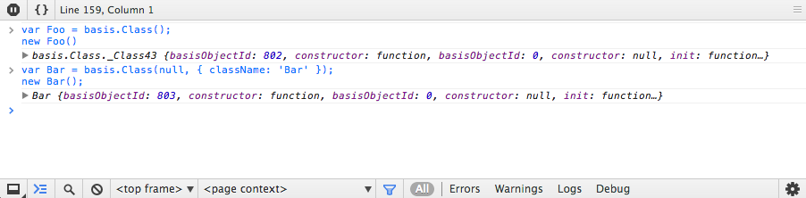

# basis.Class (классы)

Функция `basis.Class` и ее методы упрощают процесс конструирования классов. Наследование базируется на прототипном наследовании javascript.

<!-- MarkdownTOC depth=3 -->

- [Создание классов](#создание-классов)
- [Свойства класса](#свойства-класса)
- [Наследование](#наследование)
- [Жизненный цикл экземпляра](#жизненный-цикл-экземпляра)
- [Паттерны создания экземпляров](#паттерны-создания-экземпляров)
- [Авторасширение](#авторасширение)
- [Проверка принадлежности экземпляров классу](#проверка-принадлежности-экземпляров-классу)
- [Преобразование класс  экземпляр](#преобразование-класс--экземпляр)
- [Расширяемые поля](#расширяемые-поля)
  - [extensibleProperty](#extensibleproperty)
  - [customExtendProperty](#customextendproperty)
  - [nestedExtendProperty](#nestedextendproperty)
  - [oneFunctionProperty](#onefunctionproperty)
- [Хелперы](#хелперы)
  - [SELF](#self)
  - [isClass](#isclass)

<!-- /MarkdownTOC -->

## Создание классов

Классы в `basis.js` создаются с помощью функции `basis.Class` или ее алиаса `basis.Class.create`. Функция принимает произвольное количество аргументов: первый — это класс, от которого наследуется новый класс, второй и последующие — расширения создаваемого класса. Если новый класс не наследуется от другого класса, то в качестве первого параметра передается `null`.

```js
// класс
var Foo = basis.Class(null, {
  name: 'default'
});

// класс Bar наследуется от Foo
var Bar = basis.Class(Foo, {
  property: 1,
  method: function(){
    // ...
  }
});
```

В качестве расширения могут быть переданы:

  * объект – все свойства объекта (включая те, что находятся в цепочке прототипов) копируются в прототип нового класса;

  * класс, созданный `basis.Class`, - копируются свойства из прототипа этого класса;

  * функция – в этом случае используется результат выполнения функции, а сама функция получает в качестве аргумента прототип суперкласса; этот способ удобен при создания примесей, используемых для разных классов (mixin).

```js
var Foo = basis.Class(null, {
  say: function(){
    return 'foo';
  }
});
var Bar = basis.Class(null, {
  say: function(){
    return 'bar';
  }
});

var mixin = function(super_){
  // `super` является зарезервированным именем, поэтому используется `super_`.
  // для Mix1 super_ === Foo.prototype
  // для Mix2 super_ === Bar.prototype
  return {
    say: function(){
      return super_.say.call(this) + ' and mixin';
    }
  };
};

var Mix1 = basis.Class(Foo, mixin);
var Mix2 = basis.Class(Bar, mixin);


var mix1 = new Mix1();
console.log(mix1.say());
// console> foo and mixin

var mix2 = new Mix2();
console.log(mix2.say());
// console> bar and mixin
```

Для удобства отладки, в описании класса можно указать свойство `className`. В этом случае в инструментах разработки будет более "говорящее" имя экземпляра.



## Свойства класса

  * className – имя класса;
  * basisClassId_ – уникальный идентификатор класса, доступен только в `dev` режиме и используется для отладки;
  * superClass_ – ссылка на класс, от которого класс был унаследован;
  * extendConstructor_ – конструктор, используется авторасширение экземпляра (см. [Паттерны создания экземпляров](#Паттерны-создания-экземпляров));
  * \_\_extend\_\_ – метод авторасширения, создает новый класс-наследник от текущего класса на основании переданного параметра (см "[Авторасширение](#Авторасширение)");
  * isSubclassOf – метод, определяющий, является ли текущий класс потомком другого класса
    ```js
      var Foo = basis.Class();
      var Bar = Foo.subclass();

      console.log(Bar.isSubclassOf(Foo));
      // console> true
    ```

  * extend – метод для расширения прототипа класса;
  * subclass – метод, создающий новый класс, унаследованный от текущего, может служить альтернативой `basis.Class`; следующие две записи эквивалентны:
    ```js
    var MyClass = basis.Class(SomeClass,  { .. });
    var MyClass = SomeClass.subclass({ .. });
    ```

## Наследование

Любое свойство может быть переопределено в новом классе. Доступ к свойствам суперкласса производится через свойство `prototype` суперкласса.

```js
var Human = basis.Class(null, {
  name: 'no name',
  init: function(name){
    this.name = name;
  },
  say: function(){
    return basis.string.format('My name is {0}.', this.name);
  }
});

var Gamer = basis.Class(Human, {
  level: 0,
  init: function(name, level){
    Human.prototype.init.call(this, name);
    this.level = level;
  },
  say: function(){
    return Human.prototype.say.call(this) +
      basis.string.format(' I\'m {0} level.', this.level);
  }
});

var john = new Human('John');
var mario = new Gamer('Super Mario', 99);

console.log('John says:', john.say());
// console> My name is John.
console.log('Mario says:', mario.say());
// console> My name is Super Mario. I'm 99 level.
console.log(mario instanceof Human);
// console> true
console.log(mario instanceof Gamer);
// console> true
```

## Жизненный цикл экземпляра

При создании экземпляра класса вызывается конструктор - метод `init`. В этом методе свойствам присваиваются начальные значения и выполняются действия, необходимые при создании объекта данного класса.
В качестве аргументов, в этот метод передаются значения, указанные при создании экземпляра.

В `basisjs` все объекты разрушаемы. Когда экземпляр становится не нужен, вызывается его деструктор — метод `destroy`. В этом методе описываются действия, которые необходимы при разрушении объекта: обычно это разрушение вспомогательных объектов и обнуление ссылок на другие объекты.

Все экземпляры, создаваемые классами `basis.js`, имеют поле basisObjectId, содержащее уникальное значение. С помощью такого поля становится возможным создавать карты объектов и использовать их для быстрого поиска.

## Паттерны создания экземпляров

В базовом варианте классы, созданные с помощью `basis.Create`, практически ничем не отличаются от классов, созданных стандартным путем (с помощью обычной функции), кроме вызова метода `init` при создании экземпляра.

Но часто бывает, что у класса может быть много свойств, которые необходимо задавать при создании экземпляра. В этом случае удобно использовать паттерн авторасширения экземпляра при создании. Его суть состоит в том, что при создании экземпляра передается единственный параметр — объект `config`. Перед тем как будет вызван метод `init`, все свойства из `config` копируются в экземпляр.

Свойство класса `extendConstructor_` определяет, какой паттерн будет использоваться при создании экземпляров. Оно задается при создании класса. Если свойство не задано, его значение наследуется от родительского класса. Если оно `true`, то используется паттерн авторасширения экземпляра.

Другими словами: если `extendConstructor_` равно `true`, то расширять будущий экземпляр новыми свойствами можно прямо при его создании, передав объект-расширение в качестве аргумента.

```js
// простой класс, похожий на те, что создаются обычными средствами
var SimpleClass = basis.Class(null, {
  name: 'no name',
  init: function(name){
    this.name = name;
  }
});
var simple = new SimpleClass('Jhon');

// класс с авто-расширением
var AutoExtendClass = basis.Class(null, {
  extendConstructor_: true,
  name: 'no name'
});
var autoExtend = new AutoExtendClass({
  name: 'Jhon', // переопределяем свойство описанное в классе
  newProperty: 'something' // новое свойство
});

console.log(autoExtend.name);
// console> 'Jhon'
console.log(autoExtend.newProperty);
// console> 'something'
```

Почти у всех классов `basis.js` свойство `extendConstructor_` равно `true`.

## Авторасширение

Когда создается новый класс, он расширяется новыми свойствами. Из второго и последующих аргументов-объектов, переданных в `basis.Create`, копируются свойства в прототип нового класса. Но перед тем, как сохранить свойство, делается проверка — нет ли уже такого свойства в прототипе. Если значение есть и оно имеет метод `__extend__`, то этот метод вызывается с новым значением для прототипа, а в прототип сохраняется результат выполнения. В противном случае значение копируется в прототип как есть. Этот алгоритм иллюстрирует следующий код:

```js
for (var key in extension)
{
  var curValue = newClass.prototype[key];

  if (curValue && curValue.__extend__)
    newClass.prototype[key] = curValue.__extend__(extension[key]);
  else
    newClass.prototype[key] = extension[key];
}
```

Такая же логика используется при создании экземпляра класса с авторасширением (свойство класса `extendConstructor_` == `true`). Этот подход позволяет сокращать количество кода при наследовании классов и создании экземпляров, делая код более простым и читаемым.

Например, все классы созданные при помощи `basis.Class`, имеют метод `__extend__`. Если ему передать в качестве аргумента объект или функцию (но не "класс"), то будет создан и возвращен новый класс, унаследованный от того, у которого был вызван метод. В противном случае метод вернет то значение, что ему передали.

```js
// создание класса, у которого в качестве
// свойства childClass другой класс
var MyClass = SomeClass.subclass({
  childClass: ChildClass //уже имеет метод __extend__
});

// явное создание класса
var obj = new MyClass({
  childClass: ChildClass.subclass({ ... })
});

// метод __extend__ у классов позволяет сократить код
var obj = new MyClass({
  childClass: { ... } //неявно будет вызван метод __extend__ у текущего значения, то есть `MyClass.prototype.childClass.__extend__`
});
```

## Проверка принадлежности экземпляров классу

Созданные с помощью `basis.Class` классы поддерживают оператор `instanceof`.

```js
var Foo = basis.Class();
var Bar = basis.Class(Foo);
var Baz = basis.Class(Bar);

var baz = new Baz();

console.log(baz instanceof Baz);
// console> true

console.log(baz instanceof Bar);
// console> true

console.log(baz instanceof Foo);
// console> true

console.log(baz instanceof basis.Class);
// console> true
```

Заметьте, что базовым классом, для всех классов в basis.js, является `basis.Class`

Получить доступ к классу экземпляра можно через его свойство `constructor`, а получить доступ к суперклассу класса можно через свойство `superClass_`. Свойство `superClass_` может использоваться только для отладки в `dev` режиме.

```js
var Foo = basis.Class(null, { className: 'Foo' });
var Bar = basis.Class(Foo);

var bar = new Bar();

console.log(bar.constructor === Bar);
// console> true

console.log(bar.constructor.superClass_ === Foo);
// console> true

// выводим список наследования классов
var cls = Bar;
while (cls)
{
  console.log(cls.className);
  cls = cls.superClass_;
}
// console> subclass of Foo
// console> Foo
// console> basis.Class
```

## Преобразование класс <-> экземпляр

Экземпляры авторасширяющихся классов (у которых `extendConstructor_` == `true`) создаются подобно созданию нового класса с одним расширяющим объектом. По этой причине преобразование кода создания экземпляра в класс или класса в создание экземпляра является несложной задачей. Исключением являются свойства `className` и `extendConstructor_`, которые для экземпляра являются обычными полями, а в случае создания класса копируются в класс, а не в прототип.

```js
var Node = basis.require('basis.ui').Node;

var foo = new Node({
  template: resource('./path/to/view.tmpl'),
  childClass: {
    template: resource('./path/to/item.tmpl'),
    binding: {
      title: 'data:'
    }
  }
});

// если объект данного типа используется неоднократно,
// можно преобразовать его конфиг в класс
var Foo = Node.subclass({
  className: 'app.example.View',   // для классов имеет смысл добавлять имя класса,
                                   // что облегчает отладку
  template: resource('./path/to/view.tmpl'),
  childClass: {
    template: resource('./path/to/item.tmpl'),
    binding: {
      title: 'data:'
    }
  }
});

var foo = new Foo({
  dataSource: someDataset
});
var bar = new Foo({
  template: resource('./some/path/custom/view.tmpl'),
  dataSource: anotherDataset
});
```

В случае преобразования экземпляр->класс стоит помнить, что все экземпляры класса разделяют данные, находящиеся в прототипе. Это относится и к объектам, которые могут иметь только одного владельца.

```js
var Node = basis.require('basis.ui').Node;
var Button = basis.require('basis.ui').Button;

var foo = new Node({
  counter: 0,                // ОК: собственное значение, которое ни с кем не разделяется
  incCounter: function(){
    this.counter++;
  },
  satellite: {
    button: new Button(...)  // ОК: собственный объект, который ни с кем не разделяется
  }
});

// в то же время, использование такого же объекта для создания класса имеет проблемы
var Foo = Node.subclass({
  counter: 0,
  incCounter: function(){
    this.counter++;  // ОШИБКА: так как все экземпляры будут иметь одно и то же значение;
                     // необходимо либо явно в init присвоить начальное значение,
                     // либо использовать `this.counter += 1;`
  },
  satellite: {
    button: new Button(...)  // ОШИБКА: каждый новый экземпляр Foo будет становиться
                             // новым владельцем кнопки; необходимо позаботиться,
                             // чтобы для каждого экземпляра создавался собственный
                             // экземпляр `basis.ui.Button`
  }
});
```

Если создается множество экземпляров с одинаковым или очень похожим конфигом, то выгоднее создать новый класс. Стоит помнить: авторасширяемые поля могут неявно создавать новые объекты, что может быть нежелательным.

```js
var Node = basis.require('basis.ui').Node;
var data = [...];
var nodes = [];

for (var i = 0; i < data.length; i++)
  nodes.push(new Node({
    template: resource('./path/to/node.tmpl'),    // !!!
    name: data[i],
    childClass: {                                 // !!!
      template: resource('./path/to/item.tmpl'),  // !!!
      binding: {                                  // !!!
        title: 'data:'
      }
    }
  }));
```

Строки, отмеченные `!!!`, показывают проблемные места. В данном примере для каждого экземпляра `basis.ui.Node` будет создан свой экземпляр шаблона (т.е. экземпляр `basis.template.html.Template`; один и тот же источник шаблона будет разобран отдельно для каждого экземпляра) и свой класс для дочерних узлов, который, в свою очередь, создает отдельный экземпляр шаблона и новый объект `binding`. Правильно будет сделать следующим образом:

```js
var Node = basis.require('basis.ui').Node;
var data = [...];
var nodes = [];
var MyNode = Node.subclass({
  template: resource('./path/to/node.tmpl'),    // !!!
  childClass: {                                 // !!!
    template: resource('./path/to/item.tmpl'),  // !!!
    binding: {                                  // !!!
      title: 'data:'
    }
  }
})

for (var i = 0; i < data.length; i++)
  nodes.push(new MyNode({
    name: data[i]
  }));
```

В этом случае не будет создаваться лишних объектов.

## Расширяемые поля

Существует несколько вспомогательных функций, создающих расширяемые свойства. Такие свойства не перезаписываются, а порождают новое значение на основе текущего и нового значения. Принцип их работы основан на расширении через метод `__extend__`. То есть они создают такие объекты, у которых есть метод `__extend__`, создающий объекты, которые имеют такой же метод `__extend__`.

### extensibleProperty

Обычное дополняющее свойство.

```js
var Foo = basis.Class(null, {
  data: basis.Class.extensibleProperty({  // ключи по умолчанию
    foo: 1,
    bar: 2
  })
});
var Baz = Foo.subclass({
  extendConstructor_: true,
  data: {
    bar: 'baz',
    baz: 123
  }
});

console.log(Baz.prototype.data);
// console> { foo: 1, bar: 'baz', baz: 123 }

var baz = new Baz({
  data: {
    baz: 'baz',
    basis: true
  }
});
console.log(baz.data);
// console> { foo: 1, bar: 'baz', baz: 'baz', basis:true }

Foo.prototype.data.foo = 333;
console.log(Baz.prototype.data);
// console> { foo: 333, bar: 'baz', baz: 123 }
console.log(baz.data);
// console> { foo: 333, bar: 'baz', baz: 'baz', basis:true }
```

### customExtendProperty

То же, что и extensibleProperty, но позволяет определить собственную функцию дополнения. `extensibleProperty` эквивалентно `customExtendProperty({}, basis.object.extend)`.

```js
var Foo = basis.Class(null, {
  data: basis.Class.customExtendProperty({  // ключи по умолчанию
    foo: 1,
    bar: 2
  }, basis.object.complete)  // Если использовать complete вместо extend, свойство data
                             // будет расширяться только новыми ключами
});
var Baz = Foo.subclass({
  extendConstructor_: true,
  data: {
    bar: 'baz',              // это свойство будет проигнорировано
    baz: 3
  }
});

console.log(Baz.prototype.data);
// console> { foo: 1, bar: 2, baz: 123 }

var baz = new Baz({
  data: {
    baz: 'baz',
    basis: true
  }
});
console.log(baz.data);
// console> { foo: 1, bar: 2, baz: 3, basis:true }

Foo.prototype.data.foo = 333;
console.log(Baz.prototype.data);
// console> { foo: 333, bar: 2, baz: 3 }
console.log(baz.data);
// console> { foo: 333, bar: 2, baz: 3, basis:true }
```

### nestedExtendProperty

Создает объект, значения которого являются расширяемыми, т.е. `extensibleProperty`. Один из примеров такого свойства – это `basis.event.Emitter#listen`.

```js
var Foo = basis.Class(null, {
  data: basis.Class.nestedExtendProperty({})
});
var Baz = Foo.subclass({
  extendConstructor_: true,
  data: {
    prop: {
      a: 1,
      b: 2
    }
  }
})

var baz = new Baz({
  data: {
    prop: {
      b: 777,
      c: 3
    },
    more: {
      x: 1
    }
  }
});

console.log(baz.data);
// console> { prop: { a: 1, b: 777, c: 3 }, more: { x: 1 } }
```

### oneFunctionProperty

Создает объект, в котором для любого ключа значением является одна и та же функция. Обычно это триггеры событий.

```js
var Emitter = basis.require('basis.event').Emitter;

var Foo = Emitter.subclass({
  events: basis.Class.oneFunctionProperty(function(){
    this.doStuff();
  }, {
    event1: true,
    event2: true
  }),
  init: function(){
    this.addHandler(this.events, this);
  },
  doStuff: function(){
    // do cool stuff
  }
});

var foo = new Foo();

console.log(foo.events);
// console> {
//            event1: function(){ this.doStuff() },
//            event2: function(){ this.doStuff() },
//          }
```

## Хелперы

### SELF

Хелпер `basis.Class.SELF` позволяет классу сослаться на себя в момент своего создания. Это удобно, например, при создании рекурсивных классов.

```js
// без хелпера
var TreeNode = basis.ui.subclass({
  ...
});
TreeNode.extend({
  childClass: TreeNode
});

// с хелпером
var TreeNode = basis.ui.subclass({
  childClass: basis.Class.SELF,
  ...
});
```

### isClass

Функция `isClass` позволяет проверить, является ли значение классом, то есть функцией, созданной с помощью `basis.Class`.

```js
var Foo = basis.Class();
var Bar = function(){};

console.log(typeof Foo);
// console> 'function'
console.log(basis.Class.isClass(Foo));
// console> true

console.log(typeof Bar);
// console> 'function'
console.log(basis.Class.isClass(Bar));
// console> false
```
