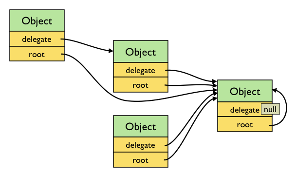
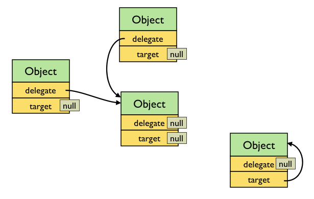
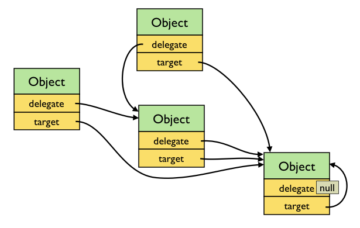

# basis.data.Object

`basis.data.Object` ([docs](http://basisjs.com/docs#basis.data.Object)) наиболее простой класс для хранения данных в виде ключ-значение. Значения воспринимаются атомарно, вложенность не поддерживается.

Наиболее часто используемый класс данных, является предком для многих других классов, в том числе для узлов интерфейса ([`basis.ui.Node`](basis.ui.md)). Модуль `basis.entity` позволяет создавать типы моделей (классы наследники `basis.data.Object`), которые имеют расширенные возможности, так как фиксированный набор полей, нормализация значений, вычисляемые поля, индексы и др.

## Работа с данными

Данные экземпляра хранятся в свойстве `data`. Для обновления данных необходимо использоваться метод `update`. Методу передается объект - набор новых значений. Метод `update` сравнивает значения ключей в переданном объекте с имеющимися, и если все значения совпадают – возвращает `false`. Если есть различия, то возвращает дельту, объект, который содержит изменные ключи и их значения до изменения.

Когда меняются значения в `data` – выбрасывается событие `update`. Обработчики события получают параметр `delta` - дельта изменений. С помощью дельты можно определить, что поменялось и восстановить состояние данных до изменений.

```js
basis.require('basis.data');

var foo = new basis.data.Object({
  data: {
    name: 'John',
    age: 25
  },
  handler: {
    update: function(sender, delta){
      if ('name' in delta)
        console.log('Name changed:', delta.name, '->', this.data.name);
    }
  }
});

console.log(foo.data.name);
// console> 'John'

console.log(foo.update({ name: 'John' }));
// console> false

console.log(foo.update({ name: 'Ivan' }));
// console> Name changed: John -> Ivan
// console> { name: 'John' }

console.log(foo.data.name);
// console> 'Ivan'

console.log(foo.update({ age: 30 }));
// console> { age: 25 }
```

## Делегирование

Несколько экземпляры `basis.data.Object` могут разделять данные и состояние. Этот процесс называется делегированием. При делегировании связанные экземпляры указывают на один тот же объект данных (их свойства `data` тождественно равны), и имеют одно и то же состояние (их свойства `state` тождественно равны).

Связывание осуществляется методом `setDelegate`. В метод передается экземпляр `basis.data.Object` или `null`. Ссылка на делегат, хранится в свойстве `delegate`.

```js
basis.require('basis.data');

var foo = new basis.data.Object();
var bar = new basis.data.Object();

foo.setDelegate(bar);

console.log(foo.delegate === bar);
// > true
console.log(foo.data === bar.data);
// > true
console.log(foo.state === bar.state);
// > true

foo.update({ prop: 123 });
console.log(foo.data.prop);
// > 123
console.log(bar.data.prop);
// > 123

bar.update({ prop: 456 });
console.log(foo.data.prop);
// > 456
console.log(bar.data.prop);
// > 456

console.log(String(foo.state));
// > 'undefined'
bar.setState(basis.data.STATE.PROCESSING);
console.log(String(foo.state));
// > 'processing'
console.log(foo.state === bar.state);
// > true
```

Если меняется делегат, то выбрасывается событие `delegateChanged`. Обработчики события получают параметр `oldDelegate` - значение свойства `delegate` до изменения. Так как при смене делегата меняются ссылки `data` и `state`, то смена делегата часто сопровождается событиями `update` (если изменились данные) и `stateChanged` (если изменилось состояние).

Экземпляр может ссылаться только на один делегат, но на экземпляр могут ссылаться сколько угодно других объектов. Объекты могут образовывать деревья (граф без циклов). Свойство `root` каждого экземпляра указывает на корень дерева, экземпляр, который ссылается сам на себя. Когда меняется значение свойства `root`, выбрасывается событие `rootChanged`, обработчикам события передается значение до изменения свойства – `oldRoot`.



Так как связанные экземпляры ссылаются на одни и те же данные и имеют общее состояние, не имеет значения, чей метод `update` или `setState` будет вызван - данные и состояние будут изменены у всех связанных объектов, и для всех объектов будут выброшены соответствующие события, при необходимости.

При сбросе делегата, объект создает копию свойств `data` и `state`, и перестает разделять их с другими. При этом событий `update` и `stateChanged` не выбрасывается (в сущности для экземпляра ничего не меняется).

Можно добавить обработчики событий для `delegate` и `root` используя [listen](basis.event.md#listen).

Чтобы определить связанны ли экземпляры делегированием используется функция `basis.data.isConnected`.

## target

Некоторые экземпляры могут быть целевыми. В этом случае его свойство `target` указывает на самого себя. При делегировании значение свойства `target` заимствуется у делегата.

Используя `target` можно образовывать деревья связанных через `delegate` объектов, которые "работают" только когда есть в дереве есть целевой объект. В такой ситуации вся структура находится в "спящем" состоянии без целевого объекта. Но как только корню назначается делегатом целевой объект или новый делегат имеет такой объект в своей цепочке делегатов (а значит его свойство `target` будет указывать на этот объект), то все объекты начинают ссылаться на него, то есть обновляется их свойство `target`, срабатывает событие `targetChanged` и структура "оживает".




Например, это может быть окно с формой редактирования, которое появляется, когда в его цепочке делегатов есть целевой объект.

```js
var myDialog = new basis.ui.window.Window({
  handler: {
    targetChanged: function(){
      if (this.target)
        this.open();
      else
        this.close();
    }
  }
});

console.log(myDialog.closed);
// > true

var proxy = new basis.data.Object();
myDialog.setDelegate(proxy);
console.log(myDialog.closed);
// > true

var target = new basis.data.Object({ target: true });
proxy.setDelegate(target);
console.log(myDialog.closed);
// > false

target.destroy();
console.log(myDialog.closed);
// > true
```

Сделать экземпляр целевым можно только при его создании. Для этого в качестве значения свойства `target` задается значение `true`.

Типизированные объекты модуля `basis.entity` являются целевыми по умолчанию.

При изменении `target` выбрасывается событие `targetChanged`, которое передает обработчикам значение `target` до изменений. Можно добавить обработчик событий для `target` используя [listen](basis.event.md#listen).

## Инициализация

При создании можно задать свойства `data` и `delegate`. Если задано свойство `delegate`, то свойства `data` и `state` игнорируются.

При создании объекта не выбрасываются события `update` и `stateChanged`. Но если задается делегат, то эти события могут быть выброшены.
