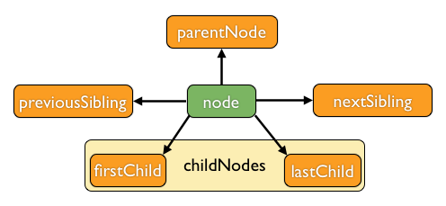

# basis.dom.wrapper

Данное пространство имен вводит классы и хелперы для организации структуры интерфейса, в основе которой находится модель DOM. Структура интерфейса приложения на `basis.js` представляет собой одно большое дерево, то есть все элементы интерфейса так или иначе связаны между собой.

Так же этот модуль описывает наиболее часто используемые паттерны, такие как сортировка, группировка, enable/disable, selection, привязка данных и другие.

Отправной точкой является класс `basis.dom.wrapper.AbstractNode`, описывающий базовый интерфейс для остальных классов.

## AbstractNode

### DOM

Основой для организации структуры являвляется модель DOM. `AbstractNode` не описывает логику работы методов, но определяет базовый интерфейс. В `basis.js` реализована не вся спецификация DOM, а взяты лишь базовые свойства и методы, которые позволяют организовать структуру и взаимодействие компонент между собой.

Поддерживаемые свойства:

  * childNodes

  * firstChild

  * lastChild

  * nextSibling

  * previousSibling

  * parentNode



Поддерживаемые методы

  * appendChild(newChild)

  * insertBefore(newChild, refChild)

  * removeChild(oldChild)

  * replaceChild(newChild, oldChild)

Перечисленные методы и свойства работают приближено к тому, как работает нативный DOM (описано в спецификации).

Помимо перечисленных методов, есть еще два дополнительных метода:

  * clear(alive) – метод удаляет все дочерние узлы, по умолчанию (`alive` == `false`), удаляемые узлы разрушаются; если это не является желаемым поведением, нужно передать `true` в качестве параметра;

  * setChildNodes(nodes) – устанавливает новый список дочерних узлов: метод очищает `childNodes` и для каждого элемента массива nodes выполняется `insertBefore`.

При изменении списка дочерних узлов срабатывает событие `childNodesModified`, которое предоставляет обработчикам дельту изменений (объект, который содержит два свойства `inserted` массив вставленных узлов, если есть, и deleted – массив удаленных узлов).

Можно добавлять обработчики событий дочерним узлам (`childNode`) и владельцу (`parentNode`) через свойство `listen`.

### Сателлиты

Традиционная модель DOM хорошо описывает списки, любой узел может содержать произвольное количество (не ограниченное сверху) улов опреденного класса или группы классов. Однако не описывает случаи единичного вхождения зависимого объекта, который может существовать максимум в единственном экземпляре. Поэтому в `basis.js` вводится собственный паттерн для решения этой задачи – сателлиты (спутники).

> Если посмотреть на HTML, то можно заметить ряд тегов, которые допускают единственное вхождение определенного тега. Например, тег <base> может присутсвовать в единственном экземпляре, если их несколько, обрабатывается первый в документе, второй и последущие игнорируются. У <table> может быть только один <thead> и <tfoot>, которые вне зависимости от места указания в разметке "прибиваются" в начало и конец таблицы соотвественно, все остальные воспринимаются как обычные <tbody>. В любом сложном интерфейсе гораздо больше уникальных классов, со своей спецификой, которые имеют необходимость в единичных именнованых вхождениях дочерних объектов. Паттерн сателитов – попытка унифицировать этот подход.

Сателлиты хранятся в свойстве `satellite`, который представляет собой объект. Ключи – это имена сателлитов, а значения – ссылки на объекты. Задать сателлит можно при создании экземпляра или методом `setSatellite(name, satellite)`, где:

  * name – имя сателлита;

  * satellite – новое значение для сателлита, должен быть экземпляр `basis.dom.wrapper.AbstractNode` иначе приравнивается `null`.

Сателлит знает о своем владельце и хранит ссылку на него в свойстве `owner`. У сателлита может быть только один владелец. Сателлиты могут передаваться от одного владельца другому. Если сателлитом завладевает другой узел, то у предыдущего владельца на него удаляется ссылка.

```js
basis.require('basis.dom.wrapper');

var node1 = new basis.dom.wrapper.Node({
  satellite: {
    example: new basis.dom.wrapper.Node({
      name: 'example'
    })
  }
});
var node2 = new basis.dom.wrapper.Node();

console.log(node1.satellite.example);
// console> basis.dom.wrapper.Node { name: 'example', ... }
console.log(node1.satellite.example.owner === node1);
// console> true

node2.setSatellite('somename', node1.satellite.example);
console.log(node1.satellite.example);
// console> null
console.log(node2.satellite.somename);
// console> basis.dom.wrapper.Node { name: 'example', ... }
console.log(node2.satellite.somename.owner === node2);
// console> true
```

Когда добавляется или удаляется сателлит, у его владельца срабатывает событие `satelliteChanged` с двумя параметрами: `name` – имя сателлита, и `oldSatellite` – значение `owner.satellite[key]` до изменения. При изменении владельца срабатывает событие `ownerChanged`, которое передает обработчикам предыдущее значение `owner`.

При разрушении владельца, разрушаются и все его сателлиты.

Можно добавлять обработчики событий сателлитам (`satellite`) и владельцу (`owner`) через свойство `listen`.

### parentNode vs. owner

У узла может быть установлен либо родительский узел (свойство `parentNode`), либо владелец (свойство `owner`). При вызове методов, которые меняют `parentNode` (методы `appendChild`, `insertBefore`, `replaceChild`, `setChildNodes`) при установленном `owner` (не равным `null`) или меняют `owner` (методы `setOwner`, `setSatellite`) при установленном `parentNode`, выбрасывается исключение.

> Наличие уставноленных обоих свойств `parentNode` и `owner` создает конфликтные ситуации, когда родитель и владелец одновременно влияют на узел или узел заимствует какие то данные из родителя или владельца. Так же это делает возможным вместо дерева получить граф содержащий циклы (рекурсия).

## Привязка данных

delegate/dataSource(+DatasetWrapper)/emit_dataSourceChanged/destroyDataSourceMember

## Сортировка и группировка

### Сортировка

sorting/sortingDesc/setSorting/emit_sortingChanged

### Группировка

grouping/setGrouping/emit_groupingChangef/GroupingNode/PartitionNode

## disable/enable

disabled/enable/disable/setDisabled/isDisabled/emit_enable/emit_disable/contextDisabled

## selection

selected/selectable/select/unselect/setSelected/setSelection/hasOwnSelection/selection/emit_select/emit_unselect/contextSelection
