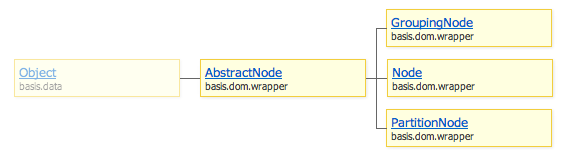

# basis.dom.wrapper

Данное пространство имен вводит классы и хелперы для организации структуры интерфейса, в основе которой находится модель `DOM`. Структура интерфейса приложения на `basis.js` представляет собой одно большое дерево, то есть все элементы интерфейса так или иначе связаны между собой.

Модуль описывает частичную [реализацию DOM модели](basis.dom.wrapper_dom.md) и ее расширение ([расширенная работа с дочерними узлами](basis.dom.wrapper_childNodes.md), [паттерн "владелец"](basis.dom.wrapper_owner.md), [сателлиты](basis.dom.wrapper_satellite.md)), а так же наиболее часто используемые паттерны, такие как [привязка данных](basis.dom.wrapper_data.md), [сортировка](basis.dom.wraper_sorting.md), [группировка](basis.dom.wrapper_grouping.md), [enable/disable](basis.dom.wrapper_disabled.md) и [selection](basis.dom.wrapper_selection.md).

Отправной точкой является класс `basis.dom.wrapper.AbstractNode`, описывающий базовый интерфейс для остальных классов. Наиболее полную реализацию имеет его наследник – класс `basis.dom.wrapper.Node`.

