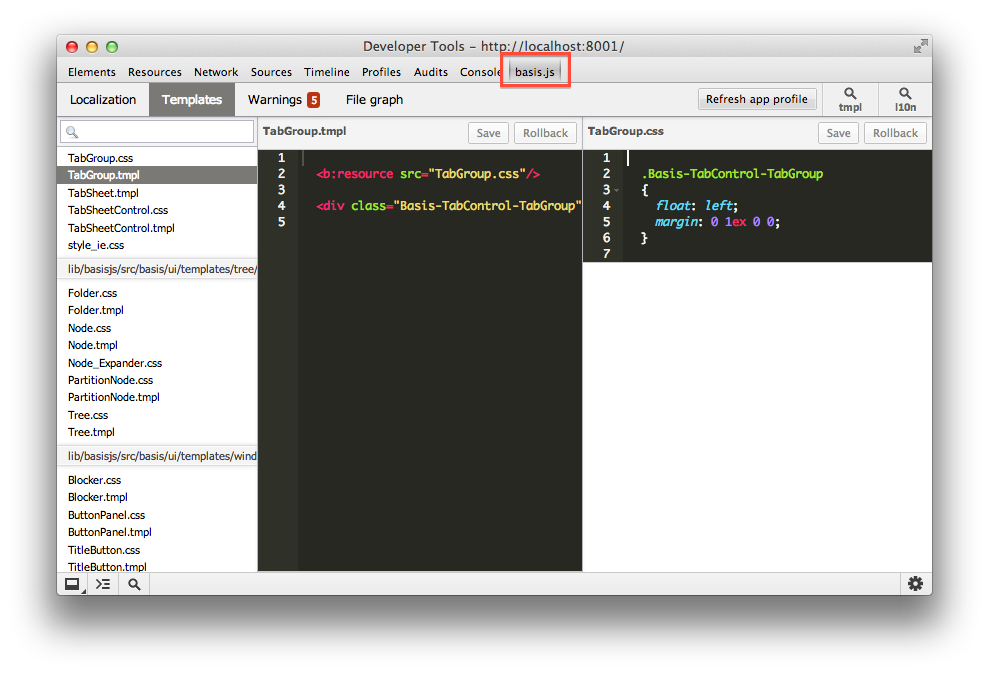

# Приступая к разработке

## Прежде чем начать

Фреймворк `basis.js` работает в двух режимах: `dev` (режим разработки) и `production` (сборка). Здесь и далее мы будем ссылаться на dev режим. Для него характерно то, что для запуска приложения в таком режиме необходим любой http-сервер, так как для загрузки модулей используется `XMLHttpRequest`, который не работает иначе. В случае сборки http-сервер не обязателен (если нет обращений к некоторому серверному API), так как все модули и ресурсы загружаются сразу вместе со страницей.

## Базовая структура страницы

Для того чтобы начать использовать `basis` необходимо его подключить. В отличие от других библиотек и фреймворков, мы чаще всего подключаем исходный код фреймворка, а не сборку, примерно такой конструкцией:

```html
<script src="path/to/basisjs/src/basis.js" basis-config="..."></script>
```

Здесь ничего необычного, за исключением атрибута `basis-config` (или его эквивалента `data-basis-config`). Этот атрибут является маркером, который определяет, что данный тег `script` подключает подключает основной модуль фреймворка (ядро). Этот атрибут используется для задания настроек, но может оставаться пустым.

Данный маркер необходим для того чтобы определить местоположение basis. Так, при загрузке ядра выбираются все доступные теги `script` и выбирается такой, у которого есть маркер. Путь к файлу этого тега используется для вычисления папки, которая будет базовой при разрешении имен файлов подключаемых через `basis.require()`. Подобная техника используется и другими фреймворками, например, Dojo.

Таким образом, простейшая страница выглядит так:

```html
<!doctype html>

<html>
<head>
  <meta http-equiv="content-type" content="text/html; charset=utf-8" />
  <title>My app</title>

  <script src="path/to/basisjs/src/basis.js" basis-config></script>
  <script>
    basis.require('basis.ui');
    basis.ready(function(){
      new basis.ui.Node({
        container: document.body,
        template: 'Hello world'
      });
    });
  </script>
</head>
<body>
</body>
</html>
```

В данном примере мы подключаем область имен `basis.ui`. Так как мы знаем путь до `basis.js`, то мы знаем папку к которой находятся все модули. В `basis` пространства имен проецируются на файловую систему. Так `basis.ui` будет располагаться в файле `path/to/basisjs/src/basis/ui.js`.

У любого приложения есть главный модуль, в котором и происходит инициализация приложения. Такой код выносится в отдельный файл. Поэтому код страницы приобретает вид:

```html
<html>
<head>
  <meta http-equiv="content-type" content="text/html; charset=utf-8" />
  <title>My app</title>

  <script src="path/to/basisjs/src/basis.js" basis-config></script>
  <script>
    basis.require('app');
  </script>
</head>
<body>
</body>
</html>
```

В данном примере, у нашего приложения корневая область имен - `app` (может использоваться любое название, но чаще всего используется это). `basis.require('app')` означает, что basis загрузит и исполнит файл `app.js`. Для всех пространств имен отличных от basis файлы будут разрешаться относительно текущего пути, то есть папки с html файлом. Но можно настроить путь для пространств имен первого уровня, для этого используется атрибут `basis-config`. По сути наличие `basis-config` у одного из `script` тегов определяет базовый путь для пространства имен `basis`, для остальных используется параметр `path`. Исходный код приложения обычно хранится в папке `src`, в таком случае тег подключения `basis` будет выглядеть так:

```html
<script src="path/to/basisjs/src/basis.js" basis-config="path: { 'app': 'src' }"></script>
```

> Значение атрибута `basis-config` - это описание javascript-объекта, без первой и последней фигурной скобки.

Так же в `basis-config` можно задать какое пространство имен нужно загрузить на старте, для этого используется свойство `autoload`:

```html
<script src="path/to/basisjs/src/basis.js" basis-config="path: { 'app': 'src' }, autoload: 'app'"></script>
```

В таком случае код с `basis.require('app')` оказывается не нужным. Можно еще немного упростить, `autoload` позволяет задавать путь перед названием пространства имен, таким образом страница начинает выглядеть так:

```html
<html>
<head>
  <meta http-equiv="content-type" content="text/html; charset=utf-8" />
  <title>My app</title>

  <script src="path/to/basisjs/src/basis.js" basis-config="autoload: 'src/app'"></script>
</head>
<body>
</body>
</html>
```

Так у приложения входная точка будет `src/app.js`, в которой будет происходить вся инициализация. Для примера с `Hello world` этот файл будет иметь вид:

```js
basis.require('basis.ui');
basis.ready(function(){
  new basis.ui.Node({
    container: document.body,
    template: 'Hello world'
  });
});
```

> Модули `basis` не могут быть подключены через тег `script` - будет ошибка. Все потому, что код модулей перед выполнением должен быть обернут в специальную функцию, которая тут же вызывается с определенными параметрами. Тем самым создается определенный контекст для кода модуля. Подобным образом работают модули в `node.js`.
> Так же нужно иметь ввиду, что код модулей выполняется в `strict mode`.


## Установка basis.js

Теперь о том как добавить фреймворк в свой проект. Но прежде чем продолжить стоит отметить, что вам понадобятся `git` и `node.js` - считается что они у вас уже установлены.

Возможные варианты:
* все делаем вручную, качаем исходники по одному из тегов с `github` – https://github.com/basisjs/basisjs/tags

* клонируем фреймворк из репозитария, выполнив в папке приложения:
  
    ```$ git clone http://github.com/basisjs/basisjs```

* используем [bower](https://github.com/bower/bower):
  
    ```$ bower install basisjs```
  
  хороший вариант, если вы не используете submodule и нужно управление версиями

* используем `basisjs-tools`


## basisjs-tools

Сам фреймворк – это набор модулей, классов и функций. Для приложения нужна структура. Так же требуется решать вопрос сборки приложения, и как то автоматизировать процесс разработки.

Для этих целей у `basis` есть специальный инструмент `basisjs-tools`. Он так же написан на javascript и работает под управлением `node.js`. Этот инструмент решает задачу генерации кода, автоматизации разработки, а так же сборки проекта.

`basisjs-tools` является отдельным проектом (http://github.com/basisjs/basisjs-tools) и устанавливается с помощью пакетного менеджера `node.js` – `npm`.

    $ npm install -g basisjs-tools

В результате `npm` установит `basisjs-tools` и в консоли станет доступна команда `basis`.

С basisjs-tools создание приложения упрощается, достаточно выполнить:

    $ basis create app myapp

И будет создана папка myapp, а в ней базовая структура приложения, уже готовое к работе. `basisjs-tools` так предложит склонировать basis с `github`, так что вам не прийдется это делать самостоятельно.

Созданная структура является базовой, ее можно изменить или использовать собственную. Но для начала изучения basis предпочтительней использовать предложенную структуру, так как все примеры будут опираться на нее.


## dev-сервер

Как говорилось ранее, для запуска приложения на basis, можно использовать любой http-сервер. Но лучше использовать http-сервер из `basisjs-tools`, так как он, помимо функций стандартного сервера, обеспечивает ряд оптимизаций по загрузке ресурсов basis, а так же обеспечивает механизм обновления ресурсов без перезагрузки, таких как шаблоны, словари и стили (механизм `live update`).

Для запуска `basisjs-tools `веб-сервера достаточно в папке проекта выполнить команду

    $ basis server

После чего сервер будет запущен. По умолчанию используется порт `8001`. Это значение берется из `basis.config` и его можно изменить, либо же переопределить параметром `-p` (или `--port`) при выполнении команды для запуска сервера, например:

    $ basis server -p 8123

Как только сервер запущен в браузере можно открыть адрес `http://localhost:8001` и увидеть поздравление, что приложение работает.

Уже сейчас работает live update для шаблонов и словарей. Посмотрим как это работает. Для этого откроем файл `myapp/src/app/template/layout.tmpl` в редакторе и изменим, например, текст в теге `h1` на `Hello world` и сохраним файл. Как только файл будет сохранен – текст на странице изменится, для этого даже не надо перезагружать страницу.Тот же эффект можно увидеть, если поменять, к примеру, файл `myapp/src/app/template/layout.css` – изменения применяются сразу, как только файл сохранен.


## Плагин

Можно заметить, что в приложении подключается devpanel (это делается вызовом `basis.require('basis.devpanel')` в файле `myapp/src/app.js`). Это специальная панель разработчика (синяя плашка на странице), которая позволяет переключать тему и язык, а так же выбирать шаблон и текст для редактирования. Выбор шаблона и текста не имеют смысла без инструмента редактирования. Таким инструментом является плагин для Developer Tools браузера Google Chrome.

Для его установки нужно открыть [страницу плагина](https://chrome.google.com/webstore/detail/basisjs-tools/paeokpmlopbdaancddhdhmfepfhcbmek) в Chrome web store и нажать кнопку установки. Как только он установится в Developer Tools появится новая вкладка `basis.js` – это и есть установленный плагин.



> После установки требуется открытые окна/панели Developer Tools закрыть и открыть заново. Так же для корректного выбора шаблона или теста словаря в плагине, необходимо чтобы было открыто окно Developer Tools и закладка с плагином (в данный момент плагинам не разрешено это делать самостоятельно).


## Сборка

В данной статье процесс сборки не будет описан подробно, это тема для отдельной статьи. Лишь заметим что это такой же простой процесс, как и запуск dev-сервера. Для того чтобы получить сборку проекта, достаточно выполнить в папке приложения:

    $ basis build

После того как отработает команда, в папке build будут лежать файлы сборки, то есть все те файлы, которые необходимы для работы приложения. Содержимое этой папки отправляется на production.

> Какой файл является индексным, куда сохранять сборку и другое - настраивается в `basis.config` или через параметры при вызове команды.

## Заключение

Итак, у нас все готово для разработки приложения.

Краткий список того что нужно сделать, чтобы начать:

* установить basisjs-tools

    ```$ npm install -g basisjs-tools```

* установить [плагин](https://chrome.google.com/webstore/detail/basisjs-tools/paeokpmlopbdaancddhdhmfepfhcbmek) для Google Chrome

* создать шаблон приложения

    ```$ basis create app myapp```

* запустить сервер в папке приложения

    ```$ basis server```
