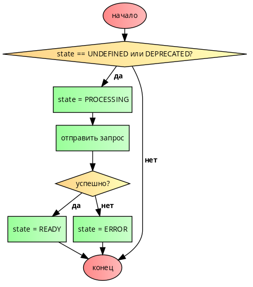

# Http and Enteties

В нашем приложении мягко говоря отчетливо прослеживается сущность героя. Для подобных случае в `basis.js` существует Entity.

Модуль `basis.entity` расширяет функциональность модуля basis.data и предназначен для описания типизированных моделей данных.

Объявление типа (его создание) выполняется с помощью функции createType. Этой функции передается конфигурация будущего типа, а результатом выполнения является функция-обертка (тип).

В нашем случае создание сущности героя будет выглядеть следующим образом:

```js
var entity = require('basis.entity');

var Hero = entity.createType({
  name: 'Hero',
  fields: {
    // описание полей
  }
});
```

Основной «настройкой» является fields — набор полей, а точнее фиксированный набор ключей поля data. Его нельзя изменить после объявления, и все экземпляры типа обязательно будут содержать заданный набор ключей.

Не менее важным является указание названия типа — name. Это не только помогает в разработке и отладке, но также позволяет осуществлять позднее связывание типов между собой. Если название типа не задается, оно генерируется автоматически. Нельзя объявить тип с именем, которое уже занято. В случае конфликта имен имя для нового типа игнорируется (генерируется автоматически). Таким образом, для одного имени может быть создан только один тип.

Обычно при объявлении типа достаточно указать его название и описать поля. Поэтому у createType есть сокращенный синтаксис, и предыдущий пример может быть описан так(создайте этот файл в вашем проекте):

`app/type/hero.js`:
```js
var entity = require('basis.entity');

var Hero = entity.createType('Hero', {
    id: entity.IntId,
    title: String
});

module.exports = Hero;
```

В приложении как правило много различных моделей, поэтому создадим корнеавой файл `type.js` хранящий ссылки на все наши модели:

`app/type.js`
```js
module.exports = {
    Hero: require('./type/hero')
};
```

В результате в `Hero` будет хранится функция, которая по сути является фабрикой экземпляров и чтобы в дальнейшем заполнить нашу сущность данными можно просто вызывать это функцию с передачей ей объекта со свойствами согласно объявленной сущности. Но в таком виде сущности как правильно используются редко.

```js
Hero({ id: 1, title: 'Your title' });
```

Для ознакомления со всеми возможностями и свойствами `Entity` рекомендуем прочесть соответствющий раздел документации после прохождения этой главы. ([ссылка](https://github.com/basisjs/articles/blob/master/ru-RU/basis.entity.md))

Сущности удобнее всего использовать для синхронизации представлений с данными приходящими с сервера. До этого момента все данные для нашего приложения мы генерировали самостоятельно, но в реальности они приходят с сервера.

Чтобы самим не реализовывать сервер иы используем открытые данные по героям игры Dota с сайта https://www.opendota.com/.

API для получения данных по героями - https://api.opendota.com/api/heroes

Для начала нам нужно немного изменить модель героя созданного выше. т.к. данные отдаваемые https://api.opendota.com/api/heroes выглядят несколько по другому:

```json
{
  attack_type: "Melee",
  id: 1,
  legs: 2,
  localized_name: "Anti-Mage",
  name: "npc_dota_hero_antimage",
  primary_attr: "agi",
}
```

Изменить сущность `Hero`:

`app/type/hero.js`:
```js
var Hero = entity.createType('Hero', {
    id: entity.IntId,
    title: String,
    name: String,
    primary_attr: String,
    attack_type: String
});
```

Но вот проблема - у нас больше нет в ответе поля `title`! Но нам не ведь хочется менять по всеми приложению наше свойство `title`? А что если нам вообще нужно произвести какие-то трансформации с пришедшими данными?

На этот случай у сущностей есть метод `extendReader`, который позволяет приводить приходящие данные к нужному виду.

``app/type/hero.js`:`
```js
var entity = require('basis.entity');

var Hero = entity.createType('Hero', {
    id: entity.IntId,
    title: String,
    name: String,
    primary_attr: String,
    attack_type: String
});

Hero.extendReader(function(data) {
    data.title = data.localized_name;
});

module.exports = Hero;
```

Отлично, с `title` разобрались. Теперь осталось понять как эти данные правильно запросить и передать в представление.

Основой для сетевого взаимодействия является модуль `basis.net`. Он не реализует конкретного способа сетевого сообщения, но предоставляет базовую функциональность.

Но больше всего нас сейчас интерсесует подмодуль `basis.net.action`. Он используется для создания интерфейса между моделью данных приложения и серверным API. а это именно то что нам нужно.

Функция `basis.net.action.create` по переданному конфигу возвращает функцию, которая вызывает метод request созданного экземпляра.

При этом состояние модели синхронизируется с состоянием запроса.

И тут мы подходим к одному важному моменту - в `basis.js` заложена концепция состояний, когда у каждого типа данных в `basis.js` есть несколько состояний:

* `UNDEFINED` — состояние данных неизвестно (состояние по умолчанию)
* `PROCESSING` — данные в процессе загрузки/обработки
* `READY` — данные загружены/обработаны и готовы к использованию
* `ERROR` — во время загрузки/обработки данных произошла ошибка
* `DEPRECATED` — данные устарели и необходимо снова синхронизировать

`basis.net.action` предназначен как раз для того, чтобы создавать функций-заготовки для синхронизации данных и `action.create` про которую мы говорили сама переключает данные в нужное состояние по мере изменений их состояния.

`Схема переключения состояний:`



Но давайте лучше разберем все это на практике!


