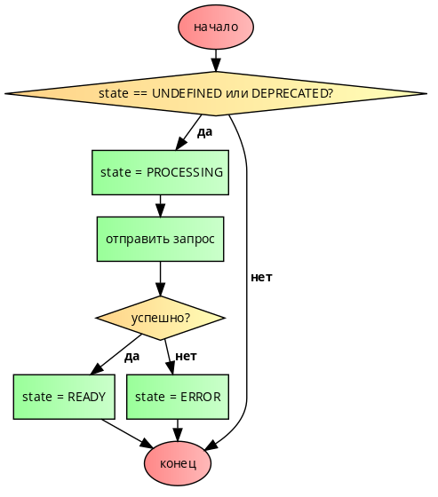

# Http and Entities

В нашем приложении отчетливо прослеживается сущность героя. Для подобного случая в `basis.js` есть `Entity`.
Модуль `basis.entity` расширяет функциональность модуля `basis.data` и предназначен для описания типизированных моделей данных.

Создание типа выполняется с помощью функции `createType`. Этой функции передается конфигурация будущего типа, а результатом выполнения является функция-обертка (тип).

В нашем случае создание сущности героя будет выглядеть следующим образом:

```js
var entity = require('basis.entity');

var Hero = entity.createType({
  name: 'Hero',
  fields: {
    // описание полей
  }
});
```

Главной «настройкой» является `fields` — набор полей, а точнее фиксированный набор ключей поля `data`. `Fields` нельзя изменить после объявления, и все экземпляры типа обязательно будут содержать заданный набор ключей.

Не менее важным является указание названия типа — `name`. Это не только помогает в разработке и отладке, но также позволяет осуществлять позднее связывание типов между собой. Если название типа не задается, то оно генерируется автоматически. Нельзя объявить тип с именем, которое уже занято. В случае конфликта имен - имя для нового типа игнорируется (генерируется автоматически). Таким образом, для одного имени может быть создан только один тип.

Обычно при объявлении типа достаточно указать его название и описать поля. Поэтому у `createType` есть сокращенный синтаксис, и предыдущий пример может быть описан так (создайте этот файл в вашем проекте):

`app/type/hero.js`:
```js
var entity = require('basis.entity');

var Hero = entity.createType('Hero', {
    id: entity.IntId,
    title: String
});

module.exports = Hero;
```

В приложении как правило много различных моделей, поэтому создадим корневой файл `type.js` хранящий ссылки на все наши модели:

`app/type.js`
```js
module.exports = {
    Hero: require('./type/hero')
};
```

В результате в `Hero` будет хранится функция, которая по сути является фабрикой экземпляров, и чтобы в дальнейшем заполнить нашу сущность данными, можно вызывать эту функцию с передачей ей объекта со свойствами согласно объявленной сущности. Но таким образом сущности заполняются редко:

```js
Hero({ id: 1, title: 'Your title' });
```

Для ознакомления со всеми возможностями и свойствами `Entity` рекомендуем прочесть соответствующий раздел документации после прохождения этой главы. ([ссылка](https://github.com/basisjs/articles/blob/master/ru-RU/basis.entity.md))

Сущности удобнее всего использовать для синхронизации представлений с данными приходящими с сервера. До этого момента, все данные для нашего приложения мы генерировали самостоятельно, но в реальности они приходят с сервера.

Чтобы самим не реализовывать сервер мы используем открытые данные по героям игры Dota с сайта https://www.opendota.com/.

API для получения данных по героям - https://api.opendota.com/api/heroes

Для начала нам нужно немного изменить модель героя созданного выше. т.к. данные отдаваемые сервером выглядят несколько по другому:

Ответ сервера:
```json
{
  "attack_type": "Melee",
  "id": 1,
  "legs": 2,
  "localized_name": "Anti-Mage",
  "name": "npc_dota_hero_antimage",
  "primary_attr": "agi",
}
```

Изменим сущность `Hero`, чтобы она больше соответствовала приходящим данным:

`app/type/hero.js`:
```js
var Hero = entity.createType('Hero', {
    id: entity.IntId,
    title: String,
    name: String,
    primary_attr: String,
    attack_type: String
});
```

Но вот проблема - у нас в ответе сервера нет поля `title`! Но нам не ведь хочется менять по всему приложению свойство `title` и менять его на `localized_name`? А что если вообще нужно произвести какие-то трансформации с пришедшими данными?

На этот случай у сущностей есть метод `extendReader`, который позволяет приводить приходящие данные к нужному виду.

`app/type/hero.js`:
```js
var entity = require('basis.entity');

var Hero = entity.createType('Hero', {
    id: entity.IntId,
    title: String,
    name: String,
    primary_attr: String,
    attack_type: String
});

Hero.extendReader(function(data) {
    data.title = data.localized_name;
});

module.exports = Hero;
```

Отлично, с `title` разобрались. Теперь осталось понять, как эти данные правильно запросить и передать в представление.

Основой для сетевого взаимодействия является модуль `basis.net`. Он не реализует конкретного способа сетевого сообщения, но предоставляет базовую функциональность.

Но больше всего нас сейчас интересует подмодуль `basis.net.action`. Он используется для создания интерфейса между моделью данных приложения и серверным API. а это именно то что нам нужно.

Функция `basis.net.action.create` по переданному конфигу возвращает функцию, которая вызывает метод `request` созданного экземпляра.

При этом состояние модели синхронизируется с состоянием запроса.

И тут мы подходим к одному важному моменту - в `basis.js` заложена концепция состояний, когда у каждого типа данных в `basis.js` есть несколько состояний:

* `UNDEFINED` — состояние данных неизвестно (состояние по умолчанию)
* `PROCESSING` — данные в процессе загрузки/обработки
* `READY` — данные загружены/обработаны и готовы к использованию
* `ERROR` — во время загрузки/обработки данных произошла ошибка
* `DEPRECATED` — данные устарели и необходимо снова синхронизировать

`basis.net.action` предназначен как раз для того, чтобы создавать функций-заготовки для синхронизации данных моделей и `action.create`, про которую мы говорили, сама переключает данные в нужное состояние по мере изменений их состояний.

`Схема переключения состояний:`



Но давайте лучше разберем все это на практике!

Сейчас нам нужно для нашей сущности задать `action` синхронизации, для этого у наборов сущностей есть метод `setSyncAction`, который принимает на вход один параметр `action`, Давайте создадим его для `Hero`:

```js
var entity = require('basis.entity');
var action = require('basis.net.action');

var Hero = entity.createType('Hero', {
    id: entity.IntId,
    title: String,
    name: String,
    primary_attr: String,
    attack_type: String
});

Hero.all.setSyncAction(action.create({
    url: 'https://api.opendota.com/api/heroes',
    success: function(data) {
        this.setAndDestroyRemoved(Hero.readList(data));
    }
}));

Hero.extendReader(function(data) {
    data.title = data.localized_name;
});

module.exports = Hero;
```

Как видно из данного примера `action.create` принимает на вход конфиг с `url` адресом для синхронизации, а так же свойство `success` в котором содержится функция которая выполнится, если действия завершится успешно.

При создании `basis.net.action` в качестве параметров может быть использован следующий набор функций:

* `request() `- результат функции будет передан в метод request транспорта;
* `prepare()`- вызывается перед отправкой запроса и служит для подготовки данных;
* `start()`- вызывается при отправке запроса;
* `success(data)` - вызывается при успешном выполнении запроса;
* `failure(error)` - вызывается при неудачном выполнении запроса;
* `abort()` - вызывается при отмене запроса;
* `complete()` - вызывается при завершении запроса независимо от его статуса.

Здесь `Hero.readList` это метод которые преобразует полученные данные в пригодные для `basis.js` сущности, `setAndDestroyRemoved` запишет эти данные в набор нашей сущности `Hero` и обеспечит их разрушение если они будут удалены.

Теперь в `hero-list` и `dashboard` нужно немного поменять код привязки `dataSource` на `Heroes.all`, чтобы указать на набор данных, а также выставить нодам `active: true`, чтобы источник данных синхронизировал свои данные сразу при создании компонентов:

`app/pages/dashboard/index.js`
```js
var Node = require('basis.ui').Node;
var Heroes = require('../../type').Hero;

module.exports = new Node({
    template: resource('./templates/dashboard.tmpl'),
    childClass: {
        template: resource('./templates/dashboard-item.tmpl'),
        binding: {
            id: 'data:',
            title: 'data:',
        },
    },
    dataSource: Heroes.all
});
```

`app/components/hero-list/index.js`
```js
var Node = require('basis.ui').Node;
var Hero = require('../hero/index');
var Heroes = require('../../type').Hero;

module.exports = new Node({
    template: resource('./templates/hero-list.tmpl'),
    active: true,
    childClass: Hero,
    selection: true,
    dataSource: Heroes.all
});
```

Крайне рекомендуем прочитать данную [статью](https://habrahabr.ru/post/305292/) про `active` и потребителей, чтобы лучше понять механизмы синхронизации.

Отлично! Теперь мы получаем наши данные с настоящего сервера!

Чтобы приложение было более полноценным давайте реализуем еще поиск по героям. Мы же не можем заставлять пользователей вручную искать героев из таких больших списков.

Прежде всего давайте создадим отдельный компонент поиска. Компонент будет максимально простым и не будет сам по себе реализовать никакой логики.

`app/components/search-input/index.js`
```js
var Node = require('basis.ui').Node;

module.exports = new Node.subclass({
    template: resource('./templates/search-input.tmpl')
});
```

`app/components/search-input/templates/search-input.tmpl`
```html
<b:style src="./search-input.css"/>
<b:isolate/>

<div class="search-wrapper">
  <label for="search">Search: </label>
  <input type="text" id="search" event-input="input">
</div>
```


`app/components/search-input/templates/search-input.css`
```css
.search-wrapper {
  text-align: center;
  margin: 10px 0;
}

label {
  vertical-align: middle;
}
input {
  vertical-align: middle;
}
```

Обратите внимание что мы предоставили шаблону `event-input="input"`, хотя не написали никаких обработчиков на это действие в js файле компонента.
Это сделано для того чтобы определить обработчики на этот `action` в других компонентах в которые он будет встроен.

Вторая вещь, на которую нужно обратить внимание — это создание компонента через `Node.subclass`. Если бы мы создали компонент через `new Node`, то использование этого компонента в качестве сателлита в нескольких местах приводило бы к уничтожению его других экземпляров. С `subclass` вам нужно будет создавать экземпляр компонента непосредственно в том месте, где будете его использовать.

Вернёмся к `hero-list` компоненту и создадим экземпляр компонента SearchInput, подключив его как сателлит. Действия, обрабатываемые компонентом реализуем на месте, добавив в `action` обработчик:

`app/components/hero-list/index.js`
```js
var Node = require('basis.ui').Node;
var Hero = require('../hero/index');
var Heroes = require('../../type').Hero;
var SearchInput = require('../../components/search-input/index');

var searchInput = new SearchInput({
    action: {
        input: function(e) {
            console.log(e.sender.value);
        }
    }
});

module.exports = new Node({
    template: resource('./templates/hero-list.tmpl'),
    binding: {
        searchInput: searchInput,
    },
    active: true,
    childClass: Hero,
    selection: true,
    dataSource: Heroes.all
});
```

`app/components/hero-list/templates/hero-list.tmpl`
```html
<b:style src="./hero-list.css"/>
<b:isolate/>

<div>
  <!--{searchInput}-->
  <ul class="heroes">
    <!--{childNodesHere}-->
  </ul>
</div>
```

Через консоль вы можете убедиться, что наш обработчик работает. Теперь нам нужно отфильтровать данные в списке согласно тексту, который мы набираем в строке поиска.

В случае обычных JS коллекций мы могли бы просто отфильтровать данные в списке через `.filter`, но мы работаем с `datasets` и фильтровать нам нужно именно их. Ещё нам нужен аналог `.slice`, чтобы отобразить только первые N героев.

`basis.js` предоставляет аналог этих функций для работы с `dataset`. Полный список вспомогательный функций можно посмотреть в [документации](https://github.com/basisjs/articles/blob/master/ru-RU/basis.data.dataset.md)

А сейчас импортируем `Slice` и `Filter` в наш файл:

`app/components/hero-list/index.js`:
```js
// ...
var Slice = require('basis.data.dataset').Slice;
var Filter = require('basis.data.dataset').Filter;

// ...

module.exports = new Node({
    template: resource('./templates/hero-list.tmpl'),
    binding: {
        searchInput: searchInput,
    },
    active: true,
    childClass: Hero,
    selection: true,
    dataSource: Heroes.all
});
```

И нужно сделать две вещи:

1. Отфильтровать героев по введенному названию
2. Выбрать из совпадений N героев

Использование `Filter` достаточно простое, вы должны указать какой `dataset` фильтровать в свойстве `source`, а в `rule` указать функцию по которой должна происходить фильтрация. Использование `Slice` очень схоже, но вместо `rule` мы укажем свойство `limit`, которое принимает число item'ов, которые мы должны вернуть.

Обе функции возвращают новый `dataset`, поэтому мы можно последовательно использовать их в нашем коде, отдав итоговый результат в качестве значения `dataSource`.

`app/components/hero-list/index.js`:
```js
var Node = require('basis.ui').Node;
var Hero = require('../hero/index');
var Heroes = require('../../type').Hero;
var SearchInput = require('../../components/search-input/index');
var Value = require('basis.data').Value;
var Slice = require('basis.data.dataset').Slice;
var Filter = require('basis.data.dataset').Filter;

var searchInput = new SearchInput({
    action: {
        input: function(e) {
            console.log(e.sender.value);
        }
    }
});

var filtered = new Filter({
    source: Heroes.all,
    rule: function(item) {
        // ... логика фильтрации
    }
});
var top = new Slice({ source: filtered, limit: 10 });

module.exports = new Node({
    template: resource('./templates/hero-list.tmpl'),
    binding: {
        searchInput: searchInput,
    },
    active: true,
    childClass: Hero,
    selection: true,
    dataSource: top
});
```

Код работает, но при вводе текста ничего не происходит. Это связано с тем что фильтрация применяется только при создании компонента, но она не применяется каждый раз, когда значение в `input` меняется. Для этого нужно использовать `filtered.applyRule()` каждый раз когда значение `input` меняется.

Для этого мы используем встроенный в `basis.js` класс [Value](https://github.com/basisjs/articles/blob/master/ru-RU/basis.data.Value.md#value), который позволяет добавлять обработчики через метод `link`, которые срабатывают в случае изменение значения, хранящегося в `Value`. Метод `link` первым параметром принимает значение, которые будет использоваться как `this` в случае его передачи, а вторым параметром функцию слушателя. Если первый параметр `null`, то значение `this` будет браться из замыкания.

Имея всё это, мы можем реализовать до конца нашу фильтрацию:

`app/components/hero-list/index.js`:
```js
var Node = require('basis.ui').Node;
var Hero = require('../hero/index');
var Heroes = require('../../type').Hero;
var SearchInput = require('../../components/search-input/index');
var Value = require('basis.data').Value;
var Slice = require('basis.data.dataset').Slice;
var Filter = require('basis.data.dataset').Filter;

var searchedHero = new Value({ value: '' });

var searchInput = new SearchInput({
    action: {
        input: function(e) {
            searchedHero.set(e.sender.value);
        }
    }
});

var filtered = new Filter({
    source: Heroes.all,
    rule: function(item) {
        return item.data.title.toLowerCase().indexOf(searchedHero.value.toLowerCase()) !== -1;
    }
});
var top = new Slice({ source: filtered, limit: 10 });

searchedHero.link(null, function(value) {
    filtered.applyRule();
})

module.exports = new Node({
    template: resource('./templates/hero-list.tmpl'),
    binding: {
        searchInput: searchInput,
    },
    active: true,
    childClass: Hero,
    selection: true,
    dataSource: top
});
```

Точно таким же образом мы можем добавить фильтрацию в `dashboard` компонент:

`app/pages/dashboard/index.js`
```js
var Node = require('basis.ui').Node;
var DataObject = require('basis.data').Object;
var Value = require('basis.data').Value;
var Slice = require('basis.data.dataset').Slice;
var Filter = require('basis.data.dataset').Filter;
var Heroes = require('../../type').Hero;
var SearchInput = require('../../components/search-input/index');

var searchedHero = new Value({ value: '' });

var searchInput = new SearchInput({
    action: {
        input: function(e) {
            searchedHero.set(e.sender.value);
        }
    }
});

var filtered = new Filter({
    source: Heroes.all,
    rule: function(item) {
        return item.data.title.toLowerCase().indexOf(searchedHero.value.toLowerCase()) !== -1;
    }
});
var top = new Slice({ source: filtered, limit: 4 });

searchedHero.link(null, function(value) {
    filtered.applyRule();
})

module.exports = new Node({
    template: resource('./templates/dashboard.tmpl'),
    binding: {
        searchInput: searchInput,
    },
    childClass: {
        template: resource('./templates/dashboard-item.tmpl'),
        binding: {
            id: 'data:',
            title: 'data:',
        },
    },
    active: true,
    dataSource: top
});
```

`app/pages/dashboard/templates/dashboard.tmpl`
```html
<b:style src="./dashboard.css"/>

<div>
  <h3>Top Heroes</h3>
  <!--{searchInput}-->
  <div class="grid grid-pad">
    <!--{childNodesHere}-->
  </div>
</div>
```

Вот и все! Теперь на всех страницах у нас есть поиск!

То, что мы рассмотрели на протяжении этих 7ми уроков было первоначальной базой. Теперь, если вы еще подробно не смотрели [документацию](https://github.com/basisjs/articles/), то самое время сделать это, т.к. в `basis.js` есть еще много других возможностей.

Продуктивной работы!
